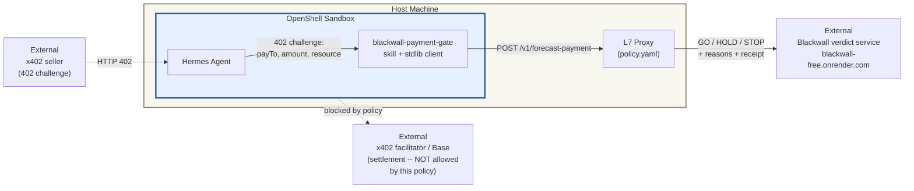

# blackwall-x402-payment-gate: Pre-Signature Payment Verdicts

An agent that can pay for things needs two layers of control: **where it can
reach** (the OpenShell network policy) and **what it may pay** (an action-layer
gate on the payment itself). This example wires a NemoClaw-constrained agent to
[Blackwall](https://blackwall-free.onrender.com/.well-known/x402), a payment-verdict
service for the [x402](https://www.x402.org/) machine-payments protocol:
before the agent signs an x402 payment, it asks Blackwall for a
**GO / HOLD / STOP** verdict computed from counterparty reputation on Base,
price-anomaly detection, OFAC sanctions screening, and Sybil/graph signals —
and only signs on GO.

The threat this closes: an injected or manipulated agent with a funded wallet
is one signature away from paying a drainer, a sanctioned address, or a
100x-gouged invoice. Egress policy alone cannot see the difference between a
fair payment and a bad one — both are a single HTTPS request to the same
facilitator. A pre-signature verdict can.

## Architecture



The sandbox's network policy (`policy.yaml`) allows exactly four routes on one
host — the verdict and outcome-report endpoints plus health and discovery —
so the agent can *ask about* a payment but this policy alone never lets it
*settle* one. The verdict is advisory by design: Blackwall returns a verdict
and the agent (or its operator) decides. When the agent should also be able to
execute GO payments, add the facilitator host to the policy deliberately, as
its own allow decision.

## What the gate returns

`POST /v1/forecast-payment` with `{counterparty, amount, asset, chain}`
(optionally `resource`, the URL being paid for, and `payer`, the agent's
wallet) returns:

| Field | Meaning |
| ----- | ------- |
| `verdict` | `GO` (sign), `HOLD` (escalate to a human), `STOP` (never sign) |
| `hard_stop` | `true` when a non-negotiable signal fired (sanctions, payload mismatch) |
| `score`, `reasons[]` | trust score plus human-readable reasons for the verdict |
| `signals{}` | per-signal breakdown: reputation, dispute rate, price anomaly, category price ratio, Sybil/cross-counterparty, temporal |
| `confidence{}` | how much evidence backs the verdict, and what is missing |
| `receipt_id`, `report_token` | used to report the payment's real outcome afterward, which feeds reputation |

The client maps verdicts to actions in one pure function
(`should_sign` in [scripts/blackwall_client.py](scripts/blackwall_client.py)):
GO → `sign`, STOP/`hard_stop` → `refuse`, everything else — including service
errors — → `escalate`. The gate fails toward human review, never toward
moving money.

## Run the demo

Requires only Python 3.10+ (the client is stdlib-only; nothing to install).

```bash
cd examples/blackwall-x402-payment-gate/scripts
python3 demo_verdicts.py
```

The demo exercises four live scenarios against the free public instance and
checks each against its expected verdict:

1. **Warm counterparty at its fair price → GO.** A payee from Blackwall's
   seed corpus with 100+ settled payments and 0% disputes, quoted at its
   on-chain median (~0.014 USDC).
2. **Same counterparty at ~3.5x its median → HOLD.** Price-anomaly signal:
   same trusted payee, gouged quote.
3. **Unknown counterparty → HOLD.** Cold start: no history means escalate,
   not trust.
4. **OFAC-sanctioned counterparty → STOP.** Hard stop from the sanctions
   screen; `should_sign` returns `refuse`.

Notes:

- The free instance spins down when idle; the **first request can take up to
  ~60s** to cold-start. Subsequent requests are fast.
- The demo addresses come from Blackwall's committed seed corpus, which is
  periodically refreshed from public Base USDC history. If a scenario drifts
  (e.g. the warm payee's median price moved), the demo reports which one and
  why instead of failing silently.
- Point `BLACKWALL_URL` at your own instance to run against a self-hosted
  deployment instead of the public free tier.

Single ad-hoc check from a shell (exit code 0 = sign, 1 = escalate,
2 = refuse):

```bash
python3 blackwall_client.py --counterparty 0x02c2fcafce36b4aadb39625866bc6b1699d83043 --amount 0.014
```

## Wiring it into an agent

- **Policy:** merge the `blackwall` network policy from
  [policy.yaml](policy.yaml) into your agent's OpenShell policy. It is
  self-contained: one host, four routes, enforce mode.
- **Skill:** drop
  [agents/hermes/skills/blackwall-payment-gate](agents/hermes/skills/blackwall-payment-gate/SKILL.md)
  into your Hermes agent's skills directory (alongside the
  [personal-community-sentiment-triage](../personal-community-sentiment-triage/README.md)
  skill layout). The skill instructs the agent to gate every x402 payment
  through the client before signing, escalate HOLDs with reasons, and report
  outcomes after settlement.
- **Outcome loop:** after a GO payment settles, call
  `report_outcome(receipt_id, report_token, "settled")` — self-reported
  outcomes feed the reputation corpus that scored the payment.

## Limits to know

- **Advisory, fail-open by design.** Blackwall never signs, holds keys, or
  blocks settlement itself; a verdict only has force because the agent's
  skill and the operator's policy give it force. Signals that depend on
  seller-controlled inputs (e.g. the resource URL that drives the category
  price baseline) are HOLD-only and evadable by a motivated seller.
- **The free public instance is a shared demo tier** — ephemeral state, idle
  spin-down, no SLA. Self-host for real workloads (the service is a single
  stdlib-only Python container; see its
  [discovery document](https://blackwall-free.onrender.com/.well-known/x402)).
- **This example moves no money.** It scores payments; it does not sign or
  settle them. Extending the policy toward a facilitator and wiring a funded
  wallet is a deliberate operator decision far outside this example's scope —
  never hand an agent mainnet keys casually.
