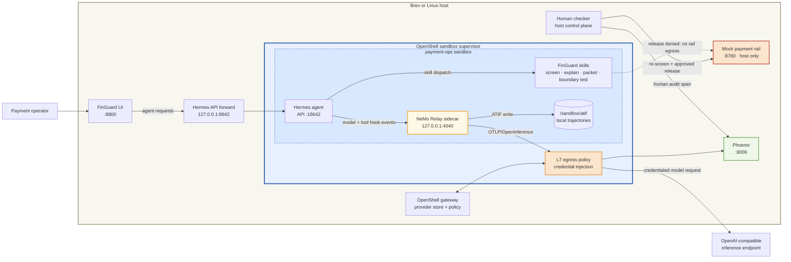

# Payment Operations Hermes Assistant — FinGuard

FinGuard is a NeMoClaw community example for a regulated payment-operations
desk. It screens synthetic outbound payments, explains holds, and prepares
cleared items for human review. The example demonstrates a platform-enforced
maker/checker boundary: the agent cannot reach the payment rail because
OpenShell never grants that egress.

The custom Hermes sandbox embeds NeMo Relay. Hermes model and tool hooks flow
to a health-checked Relay sidecar, which writes ATIF trajectories locally and
exports OpenInference spans to Phoenix.

## Deployment model

This example runs on a single Linux host or VM, including a Brev instance.
Docker hosts Phoenix, the FinGuard web UI, and a mock payment rail. The
OpenShell gateway creates and supervises a custom Hermes sandbox on the same
host.

OpenShell is the workload security boundary. It restricts network egress and
keeps the inference credential in its provider store. The sandbox may call the
configured inference endpoint and host observability service, but the payment
rail is deliberately omitted from its policy. A separate host-side human
checker is the only component permitted to call that rail.

This is an educational, single-host deployment—not a production payment
system. Production adopters should preserve its control boundaries while
replacing the fixtures and mock services with approved enterprise systems.

## Architecture



The denied edge is the central security property. FinGuard is the maker, never
the checker, and a prompt cannot override the OpenShell network policy. The
human checker runs outside the agent sandbox and emits separately identified
telemetry.

## Key invariants

- The agent can screen, explain, and prepare evidence; it cannot release or
  settle a payment.
- The sandbox has no payment-rail route or credential, even when a tool or
  prompt attempts a release.
- Only a named human action on the host may call the mock rail, and the host
  re-screens the payment before doing so.
- Agent evidence and human approval evidence have different actors and
  services in Phoenix.
- NeMo Relay records real Hermes model and tool activity. Host-only views are
  not presented as Relay traces.
- Payment fixtures are synthetic. The bundled sanctions fixture contains three
  dated public OFAC records and is not a complete sanctions list.

## Evidence model

| Action | Execution | Expected Phoenix evidence |
|---|---|---|
| Ask what FinGuard can do | Hermes agent turn | Agent and LLM spans from NeMo Relay |
| Screen one payment or the queue | Hermes invokes `payment-screening` | Agent, tool, and LLM spans from NeMo Relay |
| Explain a hold | Hermes reasons over the skill result | Agent and LLM spans from NeMo Relay |
| Prepare a release packet | Hermes invokes `release-packet` | Agent and tool spans from NeMo Relay |
| Test the agent release boundary | `rail-boundary-test` attempts access; OpenShell denies it | Tool failure and agent spans from NeMo Relay |
| Human approves or refuses release | Host checker re-screens and calls the mock rail | `finguard-host-checker` span with `actor.type=human` |

Queue display and ledger reads are views, not control decisions, so they do
not emit traces.

## Agent skills

Skills are loaded by Hermes from [`skills/`](skills/) when a task requires
them.

| Skill | Purpose |
|---|---|
| `payment-ops-playbook` | Explain FinGuard's operating model, roles, and escalation rules. |
| `payment-screening` | Apply limit, sanctions, duplicate, and beneficiary checks to synthetic payments. |
| `release-packet` | Prepare evidence for a human checker without releasing funds. |
| `rail-boundary-test` | Demonstrate that OpenShell denies agent access to the payment rail. |

## Intended user journey

1. Bring up the host observability service, OpenShell gateway/provider, custom
   Hermes + NeMo Relay sandbox, and demo services.
2. Open FinGuard and screen the queue.
3. Ask the agent to explain a held payment and inspect its Relay-generated
   trace in Phoenix.
4. Ask the agent to release a cleared payment. Observe the policy denial and
   corresponding agent/tool evidence.
5. Act as the human checker and approve a cleared payment on the host. Compare
   the separately attributed human audit span in Phoenix.
6. Download the ATIF trajectories before destroying the sandbox.

## Requirements

- Linux x86_64 or aarch64 host
- Docker with the Compose plugin
- OpenShell `0.0.53` with a running local gateway
- An OpenAI-compatible inference key

No Python virtual environment or host-side Python package installation is
required. The host utilities use Python's standard library.

Install the pinned OpenShell CLI and local gateway if the host does not already
provide them:

```console
$ curl -LsSf https://raw.githubusercontent.com/NVIDIA/OpenShell/main/install.sh | OPENSHELL_VERSION=v0.0.53 sh
```

This example downloads additional third-party open source components during
the first sandbox build. Review their license terms before use; the community
repository records them in its root `THIRD-PARTY-NOTICES` file.

## Quick start

```console
$ cp .env.example .env
$ # Edit .env and set COMPATIBLE_API_KEY.
$ openshell settings set --global --key providers_v2_enabled --value true --yes
$ bash scripts/bring-up.sh
```

`bring-up.sh` verifies the fixtures, starts Phoenix, registers the OpenShell
gateway and inference provider, builds the sandbox, and starts the host demo
services. It is also the resume command: rerunning it reuses a healthy sandbox
and restarts host services and forwarding without rebuilding the image. The
first build downloads pinned artifacts and can take several minutes.

The normal preflight prints one summary line for the six bundled payment
scenarios. To inspect every expected decision and fired control independently:

```console
$ python3 scripts/smoke-payment.py
```

If OpenShell reports that an existing sandbox is in terminal `Error` state,
inspect any evidence you need and explicitly replace only that sandbox with
cached image layers:

```console
$ bash scripts/bring-up.sh --recover-error
```

An SSH or browser disconnect does not require this flag. Use it only when
`openshell sandbox list` reports `Error`.

Open:

- FinGuard UI: `http://127.0.0.1:8800`
- Phoenix: `http://127.0.0.1:6006`
- Mock ledger: `http://127.0.0.1:8780/released` (keep private)

On Brev, expose ports `8800` and `6006` as HTTP endpoints. Do not expose port
`8780`; it represents the host-only payment boundary. See
[`docs/getting-started.md`](docs/getting-started.md) for the complete journey
and [`docs/brev-deployment.md`](docs/brev-deployment.md) for Brev-specific
access.

## Verify the deployment

```console
$ bash scripts/verify.sh
```

The verification checks fixtures, host services, the Hermes API, NeMo Relay,
Relay configuration, and the sandbox policy denial.

Exercise the host-side checker directly:

```console
$ python3 scripts/approve_release.py --id WIRE-1007 --approver "Jane Ops"
$ python3 scripts/approve_release.py --id ACH-2003 --approver "Jane Ops"
$ curl -fsS http://127.0.0.1:8780/released
```

The cleared wire is released; the sanctions-held ACH is refused. For expected
results and troubleshooting, see
[`docs/verify-functionality.md`](docs/verify-functionality.md).

## Retrieve ATIF trajectories

After at least one agent turn:

```console
$ bash scripts/download-traces.sh
```

The script copies `/sandbox/atif` from the sandbox to `.tmp/atif` on the host.
Retrieve these files before destroying the sandbox.

## Adapting this blueprint for FSI

Partners should reuse the enforced separation of duties, evidence model,
policy-first sandbox, skill packaging, and phased lifecycle scripts. They
should replace the synthetic queue, dated sanctions data, static controls,
mock rail, demo identity, and local telemetry store with approved enterprise
systems.

See [`docs/production-adaptation.md`](docs/production-adaptation.md) for a
component-by-component integration map and the controls that must remain
invariant.

## Repository layout

```text
agents/hermes/               custom Hermes + NeMo Relay image and startup
skills/                      FinGuard operating and control skills
scripts/                     phased bring-up, verification, UI, and teardown
policy.yaml                  active OpenShell sandbox policy
observability/               Phoenix Compose configuration
docs/                        setup, demo, verification, and adaptation guides
```

## Teardown

The safe default stops only the host UI and mock rail:

```console
$ bash scripts/tear-down.sh
```

Explicitly remove the sandbox and Phoenix data when required:

```console
$ bash scripts/tear-down.sh --destroy-sandbox --purge-host-services
```

## Data and safety

- Payment data is synthetic.
- The bundled sanctions fixture contains dated public reference records and is
  intentionally incomplete.
- The mock rail is not a production payment system.
- Never place customer data, production credentials, or account secrets in
  this example.
- Screening is operational support; a human remains accountable for release.
