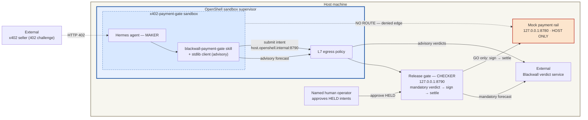

# x402-payment-gate: Verdict-Gated Payment Release

A maker/checker payment boundary for [x402](https://www.x402.org/) machine
payments, in the pattern of the
[Payment Operations Hermes Assistant](../../../nvidia/payment-ops-hermes/README.md):
the sandboxed Hermes agent can screen payments and **submit payment intents**,
but it cannot sign or settle anything — it holds no key and has no network
route to any payment rail. The **mandatory** decision lives in a host-side
**release gate outside the agent sandbox**, which asks
[Blackwall](https://blackwall-free.onrender.com/.well-known/x402) for a
**GO / HOLD / STOP** verdict — counterparty reputation on Base, price-anomaly
detection, OFAC sanctions screening, Sybil/graph signals — and only a GO is
signed and settled. The decision is **genuinely pre-signature**: no signature
exists until after the verdict, and the signing step is on a code path only
the release branch reaches (pinned by unit test).

The threat this closes: an injected or manipulated agent with payment
capability is one signature away from paying a drainer, a sanctioned address,
or a 100x-gouged invoice. Here a prompt cannot become a payment: the most a
compromised agent can do is *submit an intent*, and the checker it cannot
touch re-screens every intent before any money moves.

> **Third-party integration — requirements & support.** This is an independent
> community example contributed by BlueTier Operations, **not** a supported
> part of NemoClaw core. It calls the external Blackwall verdict service — the
> default public instance is **keyless and free** (no API key, no signup);
> self-hosting is documented for real workloads. **Support** for this example
> and the service is provided by BlueTier Operations, not NVIDIA — contact
> <bluetier.operations@gmail.com>.

> **Scope — a payment-*boundary* demonstration, not a full agent runtime.**
> `bring-up.sh` stands up the boundary (mock rail + release gate + a
> policy-scoped sandbox), and `verify.sh` exercises the in-sandbox **maker path
> at the intent-submission level** (`POST /v1/intents` over the scoped
> `host.openshell.internal` route → a live verdict) together with the denied
> edge. It does **not** start an interactive Hermes agent. The skill under
> `agents/hermes/skills/` documents how a Hermes agent *would* drive this
> boundary; actually running that agent needs a full NemoClaw Relay+Hermes
> runtime (inference provider, `nemoclaw-start`) and is a **separate operator
> step, out of scope here**. What this recipe proves — on a real OpenShell host
> — is the security property: a prompt in the sandbox cannot reach the rail, and
> every intent is re-screened by the host-side checker before any money moves.

## Architecture



The denied edge is the central security property: the rail route is absent
from `policy.yaml`, so a prompt cannot override it. Note the deliberate bind
asymmetry. The gate runs **two listeners**: a **submit/status** listener the
sandbox reaches (via the `host.openshell.internal` route) and a **host-only
approve** listener bound to `127.0.0.1:8791`. The sandbox reaches the host over
the OpenShell bridge (`host.openshell.internal` → the `openshell-docker` network
gateway), *not* host loopback — so the submit listener must bind that **specific
bridge interface**: loopback would be unreachable from the sandbox (the maker
path dies), and `0.0.0.0` would expose submission on every host interface (the
LAN included). `bring-up.sh` discovers the bridge gateway and binds the submit
listener there automatically (`RELEASE_GATE_BIND`; it defaults to a safe
`127.0.0.1` when set by hand, and is never `0.0.0.0`). The **rail** binds
`127.0.0.1` and is unreachable from the sandbox at the network layer — that
asymmetry *is* the denied edge. Splitting
the listeners means exposing the submit interface never exposes `/approve`: the
sandbox can reach only the least-privileged operation (submit), while the
human-only operations (approve, settle) live behind loopback. Everything
in-sandbox is **advisory** — the skill's pre-check warns the user early, but
nothing the agent does or skips changes what the gate enforces.

## Key invariants

- The agent can screen, explain, and submit intents; it cannot sign, release,
  or settle a payment. No signing key exists inside the sandbox (in this demo
  no real key exists anywhere — the rail signature is an explicitly labeled
  simulation).
- The sandbox has no route to the rail or any facilitator, even when a tool
  or prompt attempts one. Its egress is the inference endpoints, the verdict
  service, and the intent-submission route — nothing else.
- **Only the host-side gate settles, and it does so through exactly two
  authorization paths — never any other way.** Both run host-side and both
  decide before any signature exists (verdict → sign → settle, enforced by
  code and pinned by unit test):
  1. **Automated release** — an intent settles unattended *only* on a fresh
     **GO** verdict. HOLD and STOP never settle on this path.
  2. **Human-approved release** — a **HELD** intent (a fresh HOLD, or a
     verdict-service failure that held it) can be released by a **named human**
     plus the approval token printed only to the gate's host-side log — a value
     the sandbox cannot read; the held→releasing transition is lock-guarded
     against concurrent double-approval. This path **re-screens with a fresh
     verdict**: the named human overrides a HOLD, but a fresh **STOP** (e.g. the
     payee became sanctioned between submit and approval) refuses the release
     even with a valid operator and token — the re-forecast precedes signing, so
     the decision stays pre-signature.
  A STOP is terminal on both paths: no verdict, human, or token releases it.
- A verdict-service failure HOLDS — the mandatory layer never fails open.
- Only the payment claim (`counterparty, amount, asset, chain, resource`)
  leaves the sandbox or the host — never tool payloads, never keys.

## The verdict

The gate (and the advisory skill) call `POST /v1/forecast-payment` with the
claim and receive: `verdict` (GO/HOLD/STOP), `hard_stop`, `score`,
`reasons[]`, per-signal breakdown, confidence, and a `receipt_id` +
`report_token` for closing the loop after settlement
(`POST /v1/report-outcome`). Gate mapping (shared with Blackwall's other
guard integrations): **GO → release, HOLD → held for a human, STOP →
refused**; anything unrecognized holds.

## Lifecycle: bring-up, verify, tear-down

```bash
scripts/bring-up.sh     # host services (rail + gate) → reproducible sandbox
                        #   image (pinned Hermes base + baked skill) → sandbox
                        #   with policy.yaml applied whole
scripts/verify.sh       # unit tests + FRESH payment canaries through the gate
                        #   + denied-edge test from inside the sandbox
scripts/tear-down.sh    # sandbox → host services
```

Only python3 is required to exercise the host boundary; docker + openshell
add the sandbox phases. The policy is a **complete** sandbox policy: the
inference routes mirror the
[chief-of-staff recipe](../../../nvidia/developer-community-chief-of-staff/README.md)
unbroadened, plus this recipe's verdict and intent routes — every in-sandbox
HTTP caller is python3 or curl, exactly matching the binary allowlists.

### Verification is live and fresh

`verify.sh` initiates **new payments on every run** — nothing is inferred
from pre-existing logs:

1. Unit tests pin the decision core, including the verdict-then-sign order.
2. Three fresh canaries go through the gate against the live verdict service:
   a warm payee at its fair price (→ `released`, producing a fresh settlement),
   a sanctioned payee (→ `refused`, never signed), an unknown payee
   (→ `held`). The mock-rail ledger must grow by exactly the released one.
3. From inside the sandbox: the intent route must work and the rail route
   must be denied by the supervisor.

A held intent can then be released only by a named human holding the
approval token that the gate prints to its host-side log at startup — a
value nothing inside the sandbox can read. The approve endpoint lives on the
**host-only** listener (`127.0.0.1:8791`), which the sandbox has no route to:

```bash
curl -X POST 127.0.0.1:8791/v1/intents/<id>/approve \
  -H 'X-Operator: <your name>' -H "X-Approve-Token: <from .run/gate.log>"
```

The held→releasing→released transition is lock-guarded, so two concurrent
approvals can never both settle, and intent submission is bounded
(`RELEASE_GATE_MAX_INTENTS`, default 1000) so a compromised agent cannot grow
the store or hammer the verdict service without limit.

## Files

| Path | Purpose |
|---|---|
| `host/release_gate.py` | The checker: intent API + mandatory verdict → sign → settle. Stdlib only. |
| `host/mock_rail.py` | Host-only settlement target with an auditable ledger; the denied edge. |
| `host/test_release_gate.py` | Unit tests for the decision core (verdict mapping, order invariant, human-approval rules). |
| `agents/hermes/skills/blackwall-payment-gate/SKILL.md` | The maker skill: advisory pre-check, intent submission, hold explanations. |
| `scripts/blackwall_client.py` | Stdlib advisory client (`should_sign`: GO→sign, STOP→refuse, else escalate). |
| `scripts/demo_verdicts.py` | Standalone four-scenario live verdict walkthrough. |
| `policy.yaml` | Complete sandbox policy: inference + advisory verdict + intent routes; **no rail route**. |
| `Dockerfile` | Reproducible sandbox image: pinned Hermes base + baked skill. Built with the recipe root as context (`--from <recipe-root>`), so its `COPY` paths resolve; `.dockerignore` trims that context. |
| `scripts/bring-up.sh` · `verify.sh` · `tear-down.sh` | Lifecycle (above). |

## Production notes and limits

- **Replace the simulation at the edges, keep the boundary.** The mock rail
  and simulated signature are demo stand-ins; production adopters wire the
  release gate to a real wallet/signing provider so the same verdict gates
  real signing — see the wallet and OpenClaw adapters in the Blackwall
  repository (`integrations/wallets/`, `integrations/openclaw/`). For
  OpenClaw-runtime agents, the related in-sandbox defense-in-depth hook is
  contributed separately in the
  [BLACK_WALL Preflight Guardrail](https://github.com/NVIDIA/nemoclaw-community/pull/52)
  example.
- **Enforcement architecture: host-side gate now, Supervisor middleware as the
  documented next step.** An earlier review asked for the mandatory decision to
  run inside OpenShell's `HTTP_REQUEST`/`PRE_CREDENTIALS` **Supervisor
  middleware** (the decision function against in-flight egress, fail-closed,
  inside OpenShell's own enforcement layer). This recipe instead places the
  mandatory decision in a **host-side release gate outside the sandbox** — the
  established pattern of the
  [payment-ops-hermes recipe](../../../nvidia/payment-ops-hermes/README.md) — with
  the rail denied to the sandbox by policy. That host-side boundary is what this
  recipe validates end to end. Wiring the same verdict into Supervisor
  middleware is the **ideal fail-closed tightening and the documented next
  step**, once (and where) that configuration surface is available to community
  recipes. Adopting the host-side gate as the accepted architecture for *this*
  recipe is offered for explicit maintainer agreement; the middleware remains
  tracked as follow-up rather than silently substituted.
- **Verdict quality is advisory input, not an oracle.** Signals that depend
  on seller-controlled inputs (e.g. the resource URL driving the category
  price baseline) are HOLD-only and evadable by a motivated seller; the free
  public instance is a shared demo tier (ephemeral state, idle spin-down,
  ~60s cold start, no SLA). Self-host for real workloads.
- **This example moves no real money.** Payments settle against the bundled
  mock rail with simulated signatures. Extending to a real facilitator and a
  funded wallet is a deliberate operator decision far outside this example's
  scope.
